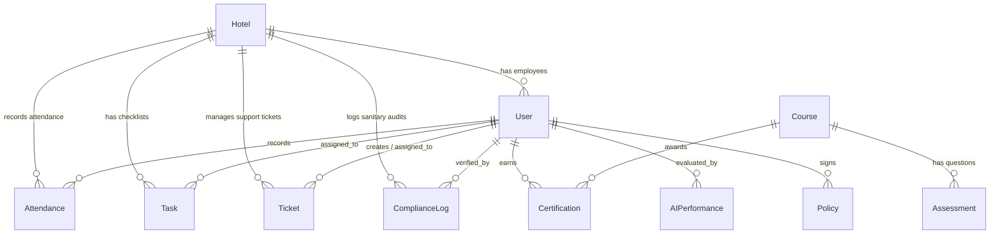

# OXY Hotels Enterprise Operations Management Platform - Architecture, API & Deployment Documentation

This document describes the database design, ER diagrams, folder structures, API definitions, CI/CD pipeline, and production deployment instructions for the OXY Hotels Enterprise Operations Management Platform.

---

## 1. Database Design & ER Diagram

The database utilizes Mongoose (MongoDB) to support multi-tenant properties. Each collection (except `Hotel` and global `AuditLog` records) holds a `hotel` reference to enforce tenant isolation.

### Entity Relationship (ER) Diagram


---

## 2. Folder Structure

```
OXY-HR PRO/
├── backend/
│   ├── Dockerfile
│   ├── src/
│   │   ├── config/             # DB & Env Configurations
│   │   ├── controllers/        # Express API Controllers
│   │   ├── middlewares/        # Auth, Role RBAC, Rate Limit & Errors
│   │   ├── models/             # Mongoose Entity Schemas (Extended)
│   │   ├── routes/             # REST Route mappings
│   │   ├── services/           # Business logic (PDF creation, evaluation)
│   │   ├── utils/              # Custom ApiError & Helper functions
│   │   ├── server.ts           # Server initialization & Socket.IO mapping
│   │   └── validations/        # Zod validation schemas
│   └── package.json
├── frontend/
│   ├── Dockerfile
│   ├── src/
│   │   ├── app/
│   │   │   ├── dashboard/      # Unified Dashboard frame & Nested child routes
│   │   │   │   ├── lms/        # Video player, assessments, certificates
│   │   │   │   ├── tickets/    # Operations IT, Maintenance, HR ticketing
│   │   │   │   ├── compliance/ # Safety, water tank, pest control checks
│   │   │   │   ├── performance/# AI scores, OPI gauge, leaderboard lists
│   │   │   │   └── policy/     # Policies center viewer & signing portal
│   │   │   └── login/          # Access gateway & signup page
│   │   ├── lib/                # API handler client & Utils
│   │   └── store/              # Zustand global state store
│   └── package.json
├── docker-compose.yml          # Container configuration for DB, Redis, API, and Web client
└── package.json                # Monorepo setup script configuration
```

---

## 3. Core API Documentation

All routes (except `/auth/login` and `/auth/register`) require standard JWT authentication passed in the `Authorization: Bearer <token>` header.

### Authentication Module
- `POST /api/auth/register` - Submit new hotel registration request (status: `Pending`).
- `POST /api/auth/login` - Verify user credentials and sign auth tokens.
- `GET /api/auth/me` - Retrieve current active user profile.

### LMS Module
- `GET /api/lms/courses` - Fetch courses assigned to employee's department.
- `POST /api/lms/courses` - Create a course + assessment quiz (Root Admin/Manager only).
- `POST /api/lms/courses/:id/assess` - Submit option indexes to grade quiz and issue certifications.

### Tickets Module
- `GET /api/tickets` - List active tenant tickets (employees see self-created/assigned tickets).
- `POST /api/tickets` - Log an operations maintenance or IT ticket.
- `PUT /api/tickets/:id/status` - Update ticket status, timeline, or delegate assignees.

### Compliance Module
- `GET /api/compliance` - List hotel compliance audit logs.
- `POST /api/compliance` - Create compliance log (water tank, pest control, safety check).

### Performance Module
- `GET /api/performance/opi/:userId` - Fetch calculated OPI scorecards for the last 6 months.
- `GET /api/performance/leaderboard` - Fetch leaderboard rankings (sorted by OPI index).
- `POST /api/performance/opi/calculate` - Run evaluation metrics to calculate and issue OPI records.

### Policy Module
- `GET /api/policies` - Retrieve hotel rules and regulations book.
- `POST /api/policies/:id/sign` - Digitally sign policy document.

---

## 4. CI/CD GitHub Action Pipeline

Save this file as `.github/workflows/deploy.yml` to automatically build, lint, test, and release Docker containers:

```yaml
name: OXY Hotels SaaS CI/CD Pipeline

on:
  push:
    branches: [ main, staging ]
  pull_request:
    branches: [ main ]

jobs:
  build-and-test:
    runs-on: ubuntu-latest
    steps:
      - name: Checkout Codebase
        uses: actions/checkout@v4

      - name: Set up Node.js Environment
        uses: actions/setup-node@v4
        with:
          node-version: 22

      - name: Install Monorepo Workspace Dependencies
        run: npm run install-all

      - name: Build Backend Service
        run: |
          cd backend
          npm run build

      - name: Build Frontend Next.js Client
        run: |
          cd frontend
          npm run build

      - name: Login to Docker Hub
        if: github.ref == 'refs/heads/main'
        uses: docker/login-action@v3
        with:
          username: ${{ secrets.DOCKER_USERNAME }}
          password: ${{ secrets.DOCKER_PASSWORD }}

      - name: Build and Push Backend Docker Image
        if: github.ref == 'refs/heads/main'
        uses: docker/build-push-action@v5
        with:
          context: ./backend
          push: true
          tags: ${{ secrets.DOCKER_USERNAME }}/oxy-hr-backend:latest

      - name: Build and Push Frontend Docker Image
        if: github.ref == 'refs/heads/main'
        uses: docker/build-push-action@v5
        with:
          context: ./frontend
          push: true
          tags: ${{ secrets.DOCKER_USERNAME }}/oxy-hr-frontend:latest
```

---

## 5. Production Deployment Guide

Follow these steps to deploy OXY Hotels Platform to AWS, GCP, or DigitalOcean:

### Prerequisites
- Install Docker & Docker Compose on your cloud server.
- Set up a MongoDB Atlas Cluster and obtain the connection URI.

### Environment Setup
Create a `.env` file inside the deployment directory containing production keys:
```env
PORT=5000
NODE_ENV=production
MONGODB_URI=mongodb+srv://<username>:<password>@cluster0.mongodb.net/oxy-hr-prod
JWT_SECRET=super-secure-production-jwt-hash-key
JWT_ACCESS_EXPIRATION_MINUTES=15
JWT_REFRESH_EXPIRATION_DAYS=7
CORS_ORIGIN=https://your-hotel-portal.com
NEXT_PUBLIC_API_URL=https://your-hotel-api.com/api
```

### Launch Container Services
Run the following commands to pull the latest images, build assets, and run services in daemon mode:
```bash
# Clone the repository
git clone https://github.com/oxyhotels/hrms.git && cd hrms

# Spin up services
docker-compose -f docker-compose.yml up --build -d

# Verify operational status of backend and frontend containers
docker-compose ps
```
The platform will now be running on port `3000` (frontend web client) and port `5000` (backend gateway API) securely.
